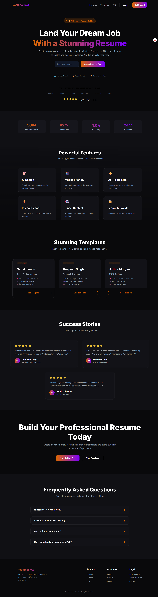
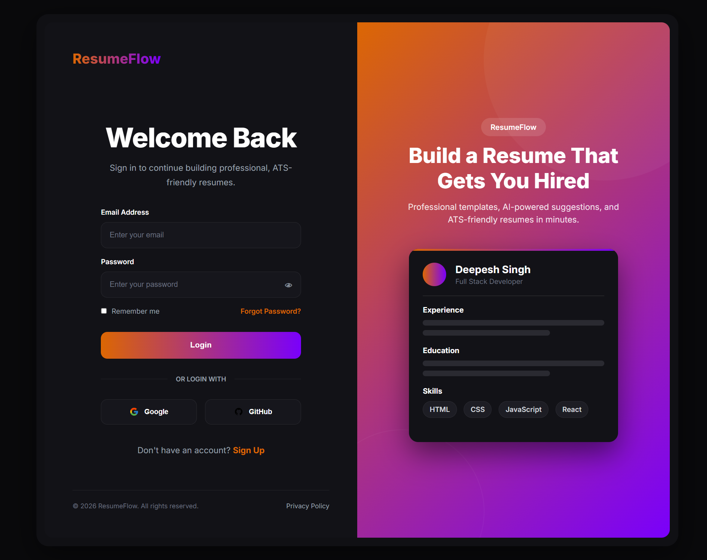
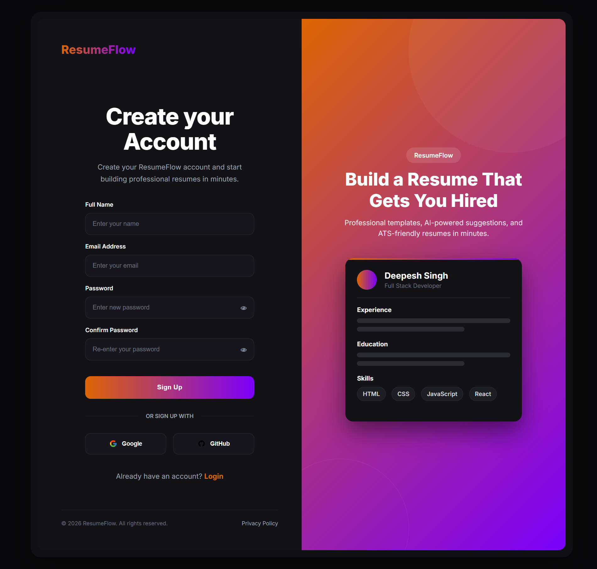

# 🚀 ResumeFlow

ResumeFlow is a modern, responsive, and AI-inspired resume builder landing page built using **HTML, CSS, and JavaScript**. The project features a premium dark UI, semantic HTML5 structure, responsive design, interactive animations, and dedicated authentication pages.

---

## 🌐 Live Demo

> Add your GitHub Pages link after deployment.

```text
https://its-deepesh.github.io/ResumeFlow/
```

---

## 📸 Preview

### Landing Page



### Login Page



### Sign Up Page



---

# ✨ Features

## 🏠 Landing Page

- Responsive Navigation Bar
- Sticky Glassmorphism Header
- Hero Section
- AI-powered Resume Builder Showcase
- Trusted Companies Section
- Statistics Cards
- Features Grid
- Resume Template Showcase
- Success Stories
- Call-to-Action Section
- FAQ Accordion
- Professional Footer
- Smooth Hover Animations
- Gradient UI Elements

---

## 🔐 Authentication

### Login Page

- Dark-themed login interface
- Professional two-column layout
- Email & Password fields
- Password visibility toggle
- Remember Me option
- Forgot Password link
- Social Login buttons
- Resume preview panel
- Responsive layout
- Footer with copyright

### Sign Up Page

- Matching UI with Login Page
- Full Name field
- Email field
- Password field
- Confirm Password field
- Social Sign Up
- Resume preview panel
- Responsive layout
- Footer with copyright

---

# 🛠️ Built With

- HTML5
- CSS3
- JavaScript (ES6)
- Google Fonts (Inter)

---

# 📂 Project Structure

```text
ResumeFlow/
│
├── index.html
├── style.css
├── script.js
│
├── LoginPage/
│     ├── login.html
│     ├── login.css
│     └── login.js
│
├── SignUpPage/
│     ├── signup.html
│     ├── signup.css
│     └── signup.js
│
├── Screenshots/
      ├── MainScreen.png
      ├── loginScreenshot.png
      └── signUpPage.png
└── README.md
```

---

# 📑 Pages

## Landing Page

- Header
- Hero
- Trusted Companies
- Statistics
- Features
- Templates
- Testimonials
- CTA
- FAQ
- Footer

## Login

- Logo
- Login Form
- Social Login
- Resume Preview
- Footer

## Sign Up

- Registration Form
- Social Sign Up
- Resume Preview
- Footer

---

# 🎨 UI Features

- Premium Dark Theme
- Orange → Purple Brand Gradient
- Glassmorphism Sticky Navbar
- Rounded Cards
- Modern Typography
- Smooth Hover Effects
- Animated Buttons
- Interactive FAQ
- Floating Resume Preview
- Responsive Grid Layouts

---

# 📱 Responsive Design

Optimized for:

- 💻 Desktop
- 💼 Laptop
- 📱 Tablet
- 📱 Mobile (768px and below)

Techniques Used:

- CSS Grid
- Flexbox
- Media Queries

---

# ♿ Semantic HTML

The project follows HTML5 semantic structure using:

- `<header>`
- `<nav>`
- `<main>`
- `<section>`
- `<article>`
- `<aside>`
- `<footer>`
- `<form>`
- `<details>`
- `<summary>`

Accessibility improvements include:

- Semantic page structure
- Proper form labels
- Navigation labels
- Button types
- ARIA attributes where appropriate

---

# 💻 JavaScript

Implemented using vanilla JavaScript.

### Features

- Responsive Mobile Navigation
- Dynamic Footer Year
- DOM Manipulation using `querySelector()`
- `textContent`
- Menu Toggle

Example:

```javascript
const year = document.querySelector("#year");

year.textContent = new Date().getFullYear();
```

---

# 🚀 Getting Started

### Clone the repository

```bash
git clone https://github.com/your-username/ResumeFlow.git
```

### Navigate into the project

```bash
cd ResumeFlow
```

### Open the project

Open **index.html** in your browser.

---

# 📄 License

This project was created for educational purposes as part of a Frontend Development Internship.

---

# 👨‍💻 Author

**Deepesh Singh**

GitHub: https://github.com/its-deepesh

---

## ⭐ If you like this project, consider giving it a star!
